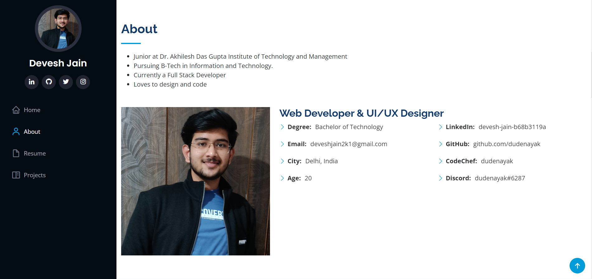
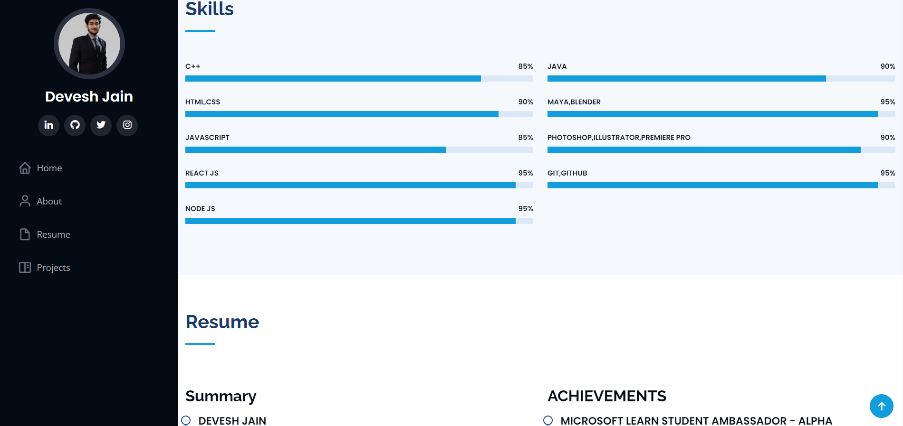
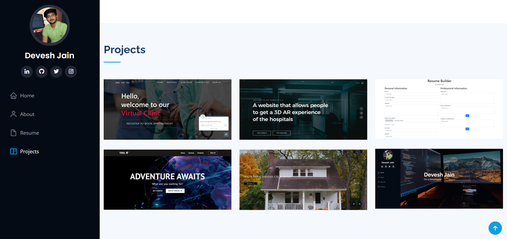

# 👨🏻‍🎓Portfolio

### Home

### About

### Resume/Skills

### Projects

## Features
* Home Page

* About Section

* Resume/Skills Section

* Projects Section

## 👇 Download Files
* Go to my GitHub repository: https://github.com/dudenayak/Portfolio

* Download Zip or clone repo

* Then open the folder in your IDE 

## 😻 Run Portfolio

Open index.html file and test it. 🎉

OR

The website is live on : https://dudenayak.github.io/Portfolio/

---

